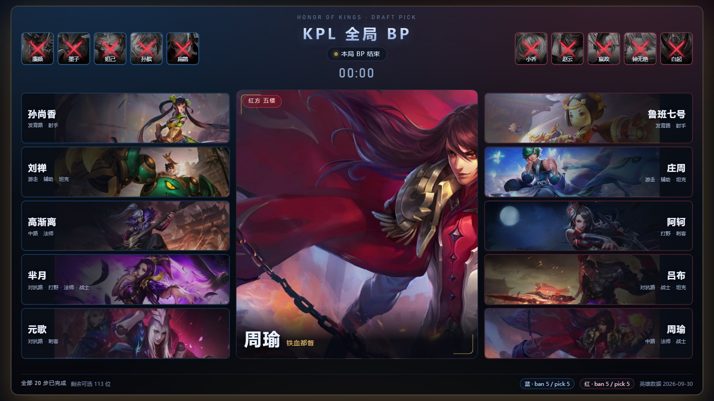
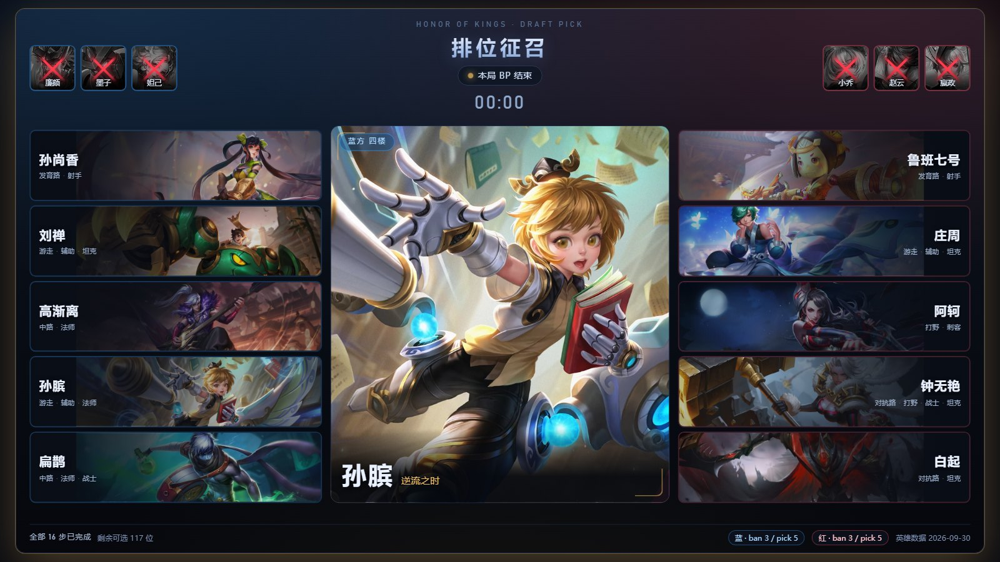
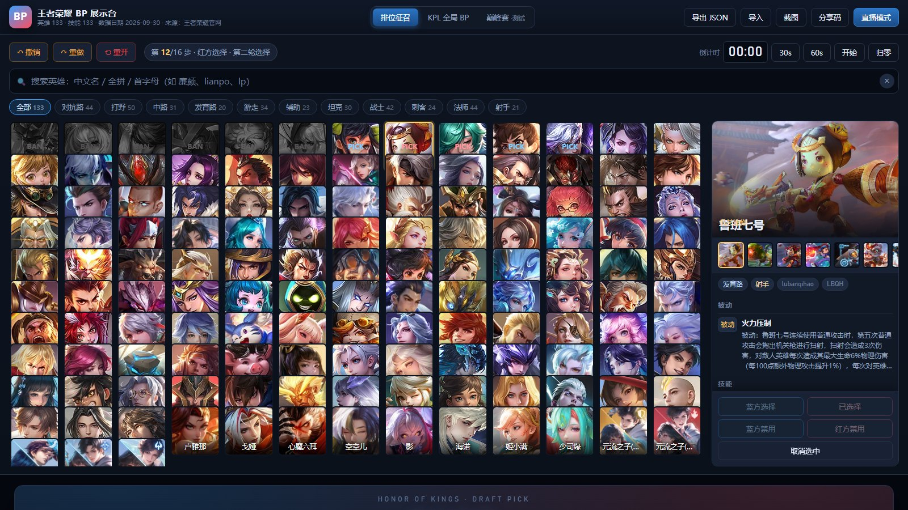
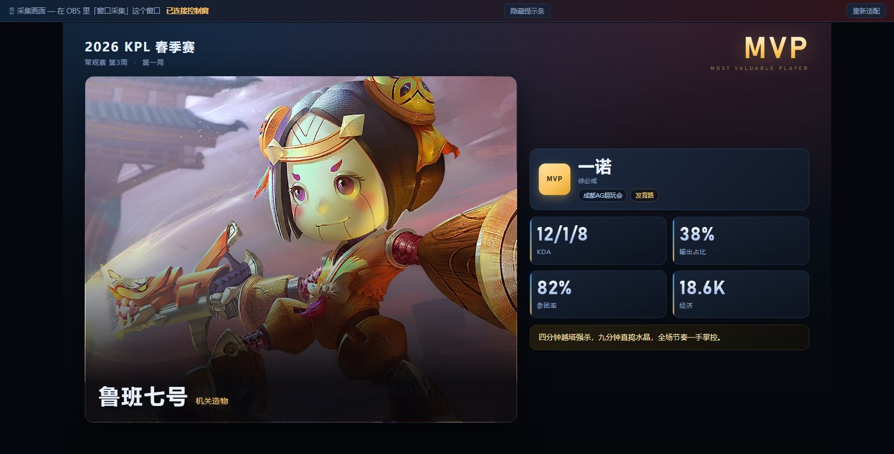
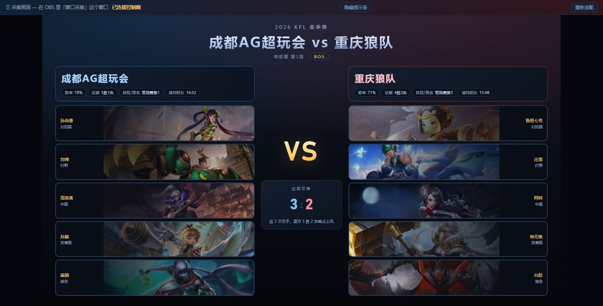
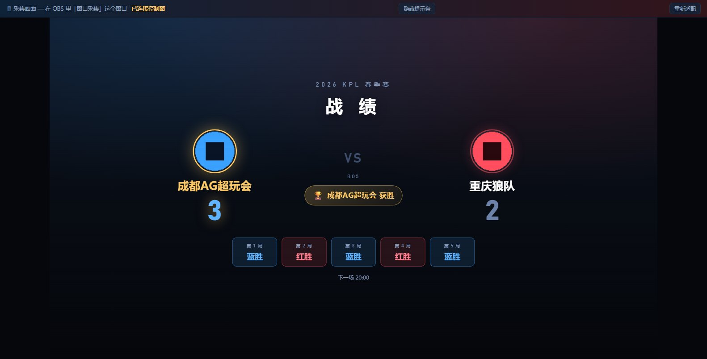
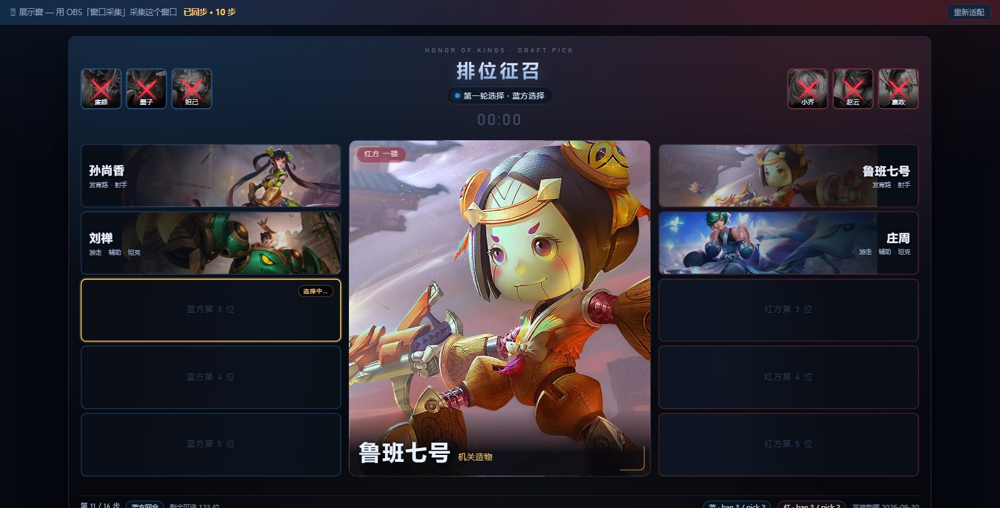

# 王者荣耀 BP 展示台

> 给直播和开黑用的 BP（Ban/Pick）工具：**双击就能用**，也能一键架到服务器上开房间多人 BP、把每局存下来回放。



<p>
  
  
  
  
  
</p>

王者荣耀 BP 展示网站，**英雄数据全部来自官网**
（[英雄列表页](https://pvp.qq.com/web201605/herolist.shtml) ·
`pvp.qq.com/web201605/js/herolist.json`，现网 **133 位英雄**，含头像 / 皮肤原画 / 分路 / 定位 / 技能），
图片直连官网 CDN（`game.gtimg.cn`）。

两种用法：

| 用法 | 怎么开始 | 能干什么 |
| --- | --- | --- |
| **纯静态** | 双击 `index.html` | 四种赛制的 BP、英雄搜索筛选、倒计时、撤销重做、MVP 卡 / 赛前面板采集窗、截图导出 |
| **联网** | 服务器跑 `install.sh`（只需域名） | 上面全部 + 房间 / 战队（每队 5 人）/ 多人实时 BP / 战绩入库 /**时间轴回放** |

---

## 一键安装（宝塔 Linux 服务器）

服务器上装好宝塔面板 + MySQL 后，**一行命令、只需填域名**：

```bash
bash <(curl -fsSL https://raw.githubusercontent.com/chenyuwebwawa/wzbp/main/install.sh) \
     --domain bp.example.com
```

远程一键模式会自动从仓库拉最新代码；也可以先克隆再装：

```bash
git clone https://github.com/chenyuwebwawa/wzbp.git
cd wzbp && sudo bash install.sh --domain bp.example.com
```

脚本会自动完成：装依赖 → 建数据库与用户 → 装依赖包 → 起 Node 服务（常驻）→
配 Nginx 站点与反代（**含 SSE 实时推送必需的配置**）→ 申请 HTTPS → 自检并告诉你访问地址。

> 装完浏览器打开你的域名，顶栏会出现「房间」入口。
> 想先看它会做什么：`bash install.sh --dry-run --domain bp.example.com`（**只打印、不改系统**，Windows 的 Git Bash 也能跑）
> 详细参数、会改哪些文件、如何卸载回滚：**[安装脚本说明](docs/安装脚本说明.md)**
> 想手动一步步来（或不用宝塔）：**[宝塔部署教程](docs/宝塔部署教程.md)**

---

## 截图

| BP 展示板（OBS 采集画面） | 控制台 |
| --- | --- |
|  |  |

| MVP 数据面板 | 赛前面板 |
| --- | --- |
|  |  |

| 战绩面板（谁赢了） | BP 展示板（含战队名与头像） |
| --- | --- |
|  |  |

| 双窗口直播（控制窗 + 展示窗各一个 OBS 源） |
| --- |
|  |

---

## 功能


### 四种赛制，随时切换

| 赛制 | 手数 | ban/pick 顺序 |
| --- | --- | --- |
| **排位征召** | 6 ban + 10 pick = 16 手 | 蓝1 → 红2 → 蓝2 → 红1，随后蓝红交替选人（与游戏内征召一致） |
| **全局 BP** | 8 ban + 10 pick = 18 手 | **第一轮** 蓝B1 红B1 蓝B1 红B1 → 蓝P1 红P2 蓝P2 红P1；**第二轮** 红B1 蓝B1 红B1 蓝B1 → 红P1 蓝P2 红P1 |
| 巅峰赛 | 6 ban + 10 pick = 11 步 | 双方禁用**同时**进行（各 3 个，整段算 1 步），随后交替选人 |
| **随机征召** | 同排位配比 | **顺序随机**（ban 段与 pick 段各自洗牌，双方数量不变、pick 仍蓝方先手），英雄仍手动选 |

**全局 BP 规则**（依据 KPL 官方口径，单边限制）：

- **本方**在本系列赛**选过**的英雄，本方后续小局不能再选；
- **对方**选过的英雄，本方不受影响；
- **禁用不进全局池** —— 每局 ban 只在本局生效，上一局被 ban 的英雄本局仍可选；
- 界面上会把这些英雄的按钮标成「蓝方已用过 / 红方已用过」并禁用。

赛制是**数据驱动**的：顺序全部写在 `js/draft.js` 顶部的 `MODES[].steps` 里。
想改成自己比赛的规则，只改那张表即可，渲染、撤销、导出等代码都不需要动。


### 战队名 + 战队头像（直播画面上显示哪支队在蓝/红方）

控制台顶部每组有「头像 + 队名」两个输入，边打边改，**展示板上立刻出现**：

- **点队名左边的圆圈就能上传战队头像**（自动缩到 128px 存本地，手机大图也不会撑爆存储）
- 头像悬停时右下角出现 × 可清除；没有头像时显示队名首字占位
- 坏图/失效链接会自动退回首字，不会显示破图

- 展示板左右两栏顶部各有一条战队名横条（蓝方蓝底、红方红底）
- 空着时显示「蓝方 / 红方」占位，不会留一片空白
- 名字过长自动缩小字号并省略，不会把横条撑破
- 与「赛前面板」的战队名是**同一份数据** —— 在哪边填都行，不会两处对不上
- 展示窗（OBS 采集画面）会同步显示

### 战绩面板（谁赢了）

第三个采集画面，专门展示**哪个战队获胜**：

- 双方**战队名 + 头像 + 大比分**，领先方高亮、冠军加金边与 🏆 横幅
- 下面一排是**每一局的胜负**（蓝胜 / 红胜），未打的显示「—」
- 数据在「赛事面板 → **战绩面板**」里逐局点「蓝胜/红胜」即可，**大比分和冠军自动算**
- 局数可「按赛制对齐」（BO5 → 5 局），也能手动加局
- 队名与头像取自「赛前面板」，不用重复填
- 采集页：overlay.html?mode=record（OBS 里加一个「窗口采集」）

### 控制台（自己看，不进直播画面）

- **搜索**：中文名 / 全拼 / 首字母 / 官网 id_name 都能搜 —— `廉颇`、`lianpo`、`lp` 命中；
  `公孙离`、`gongsunli`、`gsl` 命中；`曜` 用 `yao`、`yue`、`dongfangyao`、`dfy` 都能搜到
- **分路 / 定位筛选**：官网分路（对抗路、打野、中路、发育路、游走）+ 定位（坦克、战士、刺客、法师、射手、辅助），带数量统计
- **英雄详情**：官网原画、该英雄**全部皮肤**可切换、**被动与技能**全文（含冷却值）——
  其中元歌、兰陵王、女娲、干将莫邪、大乔、李信、盾山、敖隐这 8 位官网原文就是 4 个主动技能，会完整显示
- **ban / pick 按钮**：只在轮到的那一方、对应阶段才可点，避免手滑
- **撤销 / 重做**：选错一步不用重开（`Ctrl+Z` / `Ctrl+Y`）
- **倒计时**：30s / 60s 一键起表，`空格` 暂停继续，展示板同步显示
- **导出 / 导入 JSON**：整局 BP 存档，可再导入复盘
- **分享码**：整局 BP 压成短码，追加到网址 `index.html#bp=…` 后即可还原
- **截图**：把展示板导成 1600×900 PNG（本地 vendored 的 html2canvas，离线可用）
- **进度自动保存**：刷新或关掉再打开会恢复上一局进度，点「重开」清空

### 展示板（OBS 采集这块）

- 1600×900 设计稿，按窗口自动等比缩放
- 顶部：蓝方 ban 位 · 赛制 / 回合 / 倒计时 · 红方 ban 位（征召模式各 3 个，KPL 各 5 个）
- 中部：中央英雄大图（官方原画 + 名字 + 称号 + 楼层标签）
- 两侧：蓝方 / 红方各 5 个选手位，显示原画、英雄名、分路与定位
- 底部：进度、剩余可选数、双方 ban/pick 计数、数据日期

### 赛事面板（MVP 卡 / 赛前面板）

点顶栏「**赛事面板**」打开右侧抽屉，填完点「**打开采集窗**」，
就得到一块可以单独给 OBS 采集的画面（同样是 1600×900 设计稿）。

**MVP 卡** —— 输入选手 ID、选英雄、填战绩：

| 填什么 | 显示成什么 |
| --- | --- |
| 选手 ID / 真实姓名 / 战队 / 位置 | 右侧金色 MVP 名牌 |
| 英雄 | 左侧整幅官网原画（大字英雄名 + 称号） |
| 战绩数据 | 数值大卡片，最多 6 组自动分三列；有 KDA / 输出占比 / 参团率 / 经济 等预设，也能自己加任意项 |
| 一句话点评 | 底部金色引言条 |
| 赛事名 / 阶段 / 第几局 | 顶部标题区 |

**赛前面板** —— 双方战队情报 + 五人名单：

- 战队名、胜率、近期战绩、排名，外加任意条自定义情报（chip 展示）
- **五人英雄位会自动跟着本局 BP 走**：BP 每选一手，空位自动补上；
  撤销 / 重做 / 重开时，由 BP 自动填进去、但已经不在本局里的英雄会自动回收。
  手填或手改过的位置不会被覆盖。想强制按当前 BP 重刷一遍，点「立即用 BP 结果填充空位」
- 不想联动就取消勾选「英雄留空时，自动用本局 BP 选出的英雄补位」
- 中间 VS + 近期交锋比分与备注
- 选手位可以只填 ID、不填英雄，也能只填英雄

写入的数据会自动存本地，刷新不丢；改任何一处，采集窗立刻跟着变。

### 联网模式：房间 / 战队 / 战绩回放

部署到服务器后（见[部署教程](docs/宝塔部署教程.md)），顶栏会多出「**房间**」和「**战绩**」两个入口。

**完整流程和你线下开黑一样：队员先加入队伍 → 管理员开局 → 自动计时 → 按顺序 BP。**

| 步骤 | 谁做 | 做什么 |
| --- | --- | --- |
| ① 建房 | **管理员** | 填房间名、赛制、**BO几**、**每步限时**，并设一个**管理员账号密码** |
| ② 加入队伍 | 队员 | 打开邀请链接 → 点「加入房间」→ 在**蓝方/红方点一个空位坐下**（每队 5 人） |
| ③ **开始 BP** | **管理员** | 点房间里那个大按钮。**在此之前英雄区是锁住的**，会写明「等待管理员开始 BP」 |
| ④ BP | 全员 | 按顺序轮流 ban/pick，每步**自动倒计时**（服务端权威，最后 10 秒变红，到 0 只提示不代选） |
| ⑤ 换局 | 管理员 | 选胜负 → 「下一局」；全局 BP 的记录**跨局累计**，打满 BO几 整场结束 |
| ⑥ 回放 | 全员 | 「战绩」→ 拖时间轴跳到任意第 N 手，每步显示「第几手 / 距上一手多久 / 谁选的 / 选了谁」 |

- **服务端是权威**：轮到谁、该 ban 还是 pick、英雄是否重复 / 是否被全局 BP 禁选，全在服务端判定，
  乱点会被拒并给出中文原因（例如「现在还轮不到你」）。别人落子你这边实时跟着变（SSE）。
- **管理员能做**：开始 BP、暂停/继续计时、撤销、下一局、结束系列、重洗随机顺序。
  这些**只有管理员能操作**，避免大家同时点造成混乱。管理员不必占席位，可以是教练/裁判。
- **全局 BP**：本方选过的英雄，本方后续小局不能再选；**对方选过的不受影响**；
  上一局被 ban 的英雄本局仍可选。界面上会列出「蓝方已用 / 红方已用」并把这些英雄标灰禁用。
- **随机征召**：顺序由服务端洗牌后全房间共享，开打前管理员可重洗。

> 没有服务器时「房间」「战绩」入口自动隐藏，纯静态部分完全不受影响。


---

## 直播怎么用（推荐：多窗口）

单窗口的「直播模式」只能二选一 —— 要么看着 BP 画面，要么看着控制台。
直播时把所有画面拆成独立窗口：每个画面单独一个 OBS 源，控制窗留给自己操作。
窗口之间用 `BroadcastChannel` + `localStorage` 事件同步（同源，全部在本机，
不需要服务器、不联网）。

```
┌─────────────────────────┐        ┌─────────────────────────┐
│  窗口 A：控制窗          │  同步  │  窗口 B：展示窗          │
│  英雄列表 / 搜索 / 筛选  │ ─────► │  只有 BP 展示板          │
│  ban / pick / 撤销       │ ◄───── │  （OBS 源 1）            │
│  倒计时 / 导出 / 截图    │        └─────────────────────────┘
│  赛事面板：MVP / 赛前    │  同步  ┌─────────────────────────┐
└─────────────────────────┘ ─────► │  窗口 C：MVP 采集窗      │
                                   │  （OBS 源 2）            │
                                   ├─────────────────────────┤
                                   │  窗口 D：赛前采集窗      │
                                   │  （OBS 源 3）            │
                                   └─────────────────────────┘
```

四个窗口可以同时开、互不打架：控制窗是唯一「发号施令」的一方，其余三个只负责显示。

**怎么开**

1. 双击 `index.html` —— 这是控制窗
2. 点右上角 **「打开展示窗」**（弹窗被拦的话允许一下即可）
3. 在展示窗里会看到顶部提示条「🖥 展示窗 — 用 OBS『窗口采集』采集这个窗口」
4. OBS → 添加「窗口采集」→ 选展示窗 → 建议裁剪掉顶部那条提示（约 39px）
5. 之后在控制窗里正常 BP，展示窗会实时跟着变；撤销、重开、切换赛制都会同步
6. 赛后要放 MVP 卡：控制窗点「**赛事面板**」→ 填数据 → 「打开采集窗」（OBS 源 2）
7. 赛前要放数据面板：同一个抽屉切到「赛前面板」→ 填完 → 「打开采集窗」（OBS 源 3）。
   英雄位会自动用本局 BP 结果补上，不用重复录入

采集窗顶部那条提示可以直接点「隐藏提示条」隐藏掉，省得在 OBS 里裁剪。

**同步范围**：赛制、全部 ban/pick、撤销/重做、重开、当前中央大图与皮肤、倒计时读数、
赛事面板的全部字段。
**注意**：展示窗与采集窗都是只读展示，操作都在控制窗；关掉再开也会自动补齐当前数据。

**同步范围**：赛制、全部 ban/pick、撤销/重做、重开、当前中央大图与皮肤、倒计时读数。
**注意**：展示窗与采集窗都是只读展示，操作都在控制窗；关掉再开也会自动补齐当前数据。

### 只想用一个窗口时

点右上角 **「直播模式」** 隐藏整个控制台，留下纯 BP 画面（`Esc` 退出）。
适合分辨率够大、能一屏同时看到展示板和控制台的场景。

---

## 使用方式

1. 双击 `index.html`（控制窗）
2. 选赛制（排位征召 / KPL 全局 BP / 巅峰赛）
3. 搜索框输入英雄名或拼音 → 点英雄卡 → 点右侧「蓝方禁用」这类按钮
4. 直播：点「打开展示窗」；要放 MVP 卡 / 赛前数据就点「赛事面板」（见上一节）。
   也可以点「截图」导出 PNG 当静态背景

### 快捷键

| 按键 | 作用 |
| --- | --- |
| `/` | 聚焦搜索框 |
| `Enter` | 选中搜索结果第一个 |
| `Ctrl+Z` / `Ctrl+Y` | 撤销 / 重做 |
| `空格` | 倒计时 开始 / 暂停 |
| `Ctrl+B` | 直播模式开 / 关 |
| `Esc` | 退出直播模式 |

---

## 目录结构

```
wzbp/
├── index.html              控制窗（双击这个运行）
├── overlay.html            采集画面页（MVP 卡 / 赛前面板，由控制窗自动打开）
├── package.json            后端依赖声明（仅 mysql2）
├── README.md
├── data/
│   ├── heroes.js           133 位英雄：名称/称号/分路/定位/拼音/头像/皮肤原画
│   └── skills.js           133 位英雄：被动 + 主动技能（名称/描述/冷却）
├── server/                 Node 服务（联网模式：REST + SSE + MySQL）
├── docs/                   部署教程 / API 契约 / 安装脚本说明 / 独立验收报告
├── js/
│   ├── utils.js            工具：搜索排序、图片兜底、下载、存储、base64
│   ├── sync.js             多窗口同步（BroadcastChannel + localStorage 事件）
│   ├── net.js              网络层（健康探测 / REST / SSE / 身份）
│   ├── room-ui.js          房间与战队 UI（大厅 / 席位 / 系列赛控制台）
│   ├── replay-ui.js        战绩列表 + 时间轴回放
│   ├── draft.js            BP 规则引擎（赛制定义 / 回合校验 / 撤销重做 / 导入导出）
│   ├── board.js            展示板渲染（OBS 画面）
│   ├── overlay.js          赛事覆盖层渲染（MVP 卡 / 赛前面板）
│   ├── story.js            赛事面板数据模型（读写 / 持久化 / 与 BP 联动）
│   ├── story-ui.js         控制窗里的赛事面板表单
│   ├── overlay-page.js     采集页启动（overlay.html）
│   ├── ui.js               控制台（搜索、筛选、详情、ban/pick 按钮）
│   ├── export.js           JSON 导入导出 + 截图
│   └── main.js             主控：动作分发、倒计时、快捷键、直播/多窗口、分享码
├── styles/
│   ├── main.css            控制台样式
│   ├── board.css           展示板样式
│   └── overlay.css         赛事面板样式（含控制窗抽屉）
├── vendor/
│   ├── html2canvas.min.js  截图用（MIT，本地 vendored，离线可用）
│   └── NOTICE.md           第三方库声明与校验值
└── scripts/                数据生成与自检脚本（平时不用跑）
    ├── build-heroes.py     重新抓英雄列表 → data/heroes.js
    ├── build-skills.py     重新抓详情页 → data/skills.js
    ├── verify-engine.mjs   BP 引擎自检（145 项断言，Node 直接跑）
    ├── verify-ui.js        浏览器端 UI 自检（114 项断言，配合下面那个）
    ├── verify-ui-build.mjs 生成 _uicheck.html 供 headless Chrome 跑
    ├── verify-sync.mjs     多窗口同步自检（自动开两个窗口验证互通）
    ├── verify-overlay.mjs  MVP 卡 / 赛前面板自检（含 BP 承接与跨窗同步）
    ├── verify-offline.mjs  断网可用性自检（CDP 拦截图床）
    ├── verify-server.mjs   后端接口自检（真库/内存/无库三种模式）
    ├── verify-net-e2e.mjs  联网端到端（真服务+真库+浏览器）
    ├── REPORT-heroes.md    数据生成报告
    ├── REPORT-skills.md    技能抓取报告
    └── REPORT-html2canvas.md  截图库实测报告
```

---

## 数据来源与更新

英雄数据是**抓取官网后的静态快照**，而不是运行时请求。原因很实际：
本站要在 `file://` 下双击运行，而浏览器在 `file://` 下会禁止 `fetch`/`XHR`
读取本地文件（已实测确认），所以数据必须内置成普通 `.js`。

想更新到官网最新英雄（新英雄上线后）：

```powershell
cd 项目目录
python scripts/build-heroes.py     # 英雄/皮肤/分路/拼音 → data/heroes.js
python scripts/build-skills.py     # 详情页技能        → data/skills.js
```

两个脚本都会把抓取结果与自检证据写进 `scripts/REPORT-*.md`（覆盖率、失败清单、抽查对照）。

### 数据口径

- **分路**取官网 `roles` 字段，中文文案以官网为准：`1=对抗路 2=打野 3=中路 4=发育路 5=游走`
  （官网用的是「游走」，不是「辅助」）。已用官网资料库接口 `zlkdatasys/heroskinlist.json`
  的 `fllb_2105` 字段逐条交叉验证：130/133 集合与顺序完全一致。
- **定位**取官网 `hero_type` / `hero_type2`，映射 `1=战士 2=法师 3=坦克 4=刺客 5=射手 6=辅助`，
  与官网 `herolist.shtml` 内联 `typeMap` 及 `api.js` 的 `HERO_TYPE_NAME` 一致。
- **拼音**优先用官网 `id_name`（官方注音比机器拼音准），
  另外用本地 `pypinyin` 交叉校验并补充首字母；多音字以官网为准（如 曜 → `dongfangyao`）。
- **皮肤原画**：URL 形如 `…/skin/hero-info/{ename}/{ename}-bigskin-{N}.jpg`，
  生成时逐个 HEAD 校验，404 的不写入（所以有 15 位英雄的 `splash` 比 `skins` 少 1 张）。
  王维(138)、大禹(188)、卢雅那(547) 三位官网大图本身就是 404，`splash` 为空数组，
  界面会用首字占位块兜底 —— 不是 bug。

---

## 自检

```powershell
node scripts/verify-engine.mjs      # BP 引擎（145 项，纯 Node，最常用）
node scripts/verify-sync.mjs        # 多窗口同步（自动开两个 headless 窗口）
node scripts/verify-overlay.mjs     # MVP 卡 / 赛前面板（42 项，并输出截图到 shots/）
node scripts/verify-offline.mjs     # 断网可用性（19 项，用 CDP 拦掉官网图床）

# 联网相关（需要先起服务，见 docs/宝塔部署教程.md）
node scripts/verify-server.mjs                                 # 后端接口（真库 346 项；无库自动跳过）
node scripts/verify-net-e2e.mjs --base=http://127.0.0.1:8787    # 联网端到端（38 项，真库）
```

浏览器端 UI 自检（118 项，需要 Chrome）：

```powershell
node scripts/verify-ui-build.mjs    # 生成 _uicheck.html
& "C:\Program Files\Google\Chrome\Application\chrome.exe" --headless=new --disable-gpu `
  --user-data-dir="$env:TEMP\wzbp-check" --window-size=1600,900 --virtual-time-budget=150000 `
  --dump-dom "file:///$((Get-Location).Path -replace '\\','/')/_uicheck.html"
```

结果在输出 HTML 里的 `<pre id="smokeOut">` 中（`SUMMARY | pass=… fail=…`）。
换 `--window-size` 就能在别的分辨率下跑同一套断言（1600×900 / 1366×768 / 1280×720 /
1024×768 / 900×1000 / 800×900 都通过）。

引擎自检覆盖：四种赛制的完整 ban/pick 顺序（含全局 BP 的两轮阶段边界、巅峰赛「双方同时禁用」的同步步骤语义）、
回合校验、重复英雄拒绝、侧别容量上限、全局 BP 池（本方用过不能重选 / 对方不受限 / ban 不受限）、
撤销 / 重做、导出导入 round-trip（含中途导出的无损性）、
畸形数据容错（且不得清空当前 BP）、分享码、搜索排序优先级与分路过滤。

联网自检覆盖：建房 / 入房（满员、重连保座、指定座位被占）/ 落子五级校验 / 撤销 / 换局 /
历史 / 回放（gapMs、任意跳转）/ SSE 三类事件 / 全局池跨局累计，以及端到端
（真服务 + 真 MySQL + 浏览器：20 手蓝图注入、本机盘面完整重放、实时推送）。

---

## 说明与边界

- **版权**：英雄名称、头像、原画、技能文案均来自王者荣耀官网，版权归腾讯所有，
  本站仅作非商业的 BP 展示用途。
- **KPL 第二轮 ban 的先后手**各赛事 / 赛季略有差异，这里按「红→蓝→蓝→红」实现；
  要改成别的顺序，只改 `js/draft.js` 里 `MODES` 中的 `steps` 数组。
- **巅峰赛**是实验性赛制：它的 ban 阶段是「双方同时禁用」，整段只算 1 步（共 11 步），
  目的是让单人直播时不用来回切换操作方。
- **英雄 583（元流之子·刺客）的定位**：官网 `herolist.json` 给的 `hero_type=6`（辅助），
  但它的 `roles` 是打野、官网资料库职业字段又是刺客，数据自相矛盾。
  这里按 `herolist.json` 原样输出（`types: ["辅助"]`），属于官网数据问题。
- **英雄 177** 官网已完成改名（`herolist.json` 为「苍」），但详情页正文仍是旧名「成吉思汗」，
  技能文案保留官网原文。
- **英雄语音**未实现：官网没有公开的语音资源，强行引入需要自备大量音频文件且覆盖率很低。
- **截图**用的是本地 vendored 的 html2canvas；它必须开 `useCORS`（官网图片是跨域直链），
  不能改成 `allowTaint`，否则 canvas 被污染、导出直接抛 `SecurityError`。
  另外展示板没完整显示在屏幕上时（窗口太矮），截图可能缺内容，界面会提示先点「直播模式」。
  万一 html2canvas 卡住（极少数情况），15 秒后会强制取消并恢复状态条，可再试一次。
- **多窗口同步**依赖浏览器的同源策略：几个窗口必须是**同一个目录下的页面**
  （`file://` 下同一目录即同源，已实测）。如果浏览器禁用了 `BroadcastChannel`，
  会自动退回 `localStorage` 事件通道；两条都不可用时采集窗不会同步（其余功能不受影响）。
  **注意**：这套同源行为是在 Chrome 上实测的，Firefox 对 `file://` 的源模型不同，
  双窗口同步未必成立（未验证）。
- **赛事面板的数据不进 BP 存档**：`导出 JSON` / `分享码` 只包含 BP 本身；
  MVP 与赛前数据单独存在 `localStorage`（键 `wzbp.story.v1`），刷新不丢，但不会随 BP 导出。
- **采集窗顶部提示条**默认显示，点「隐藏提示条」可隐藏；在 OBS 里也可以直接裁剪掉那 39px。
